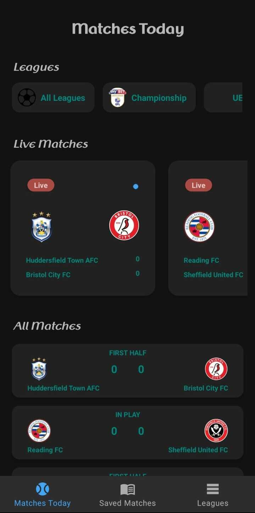
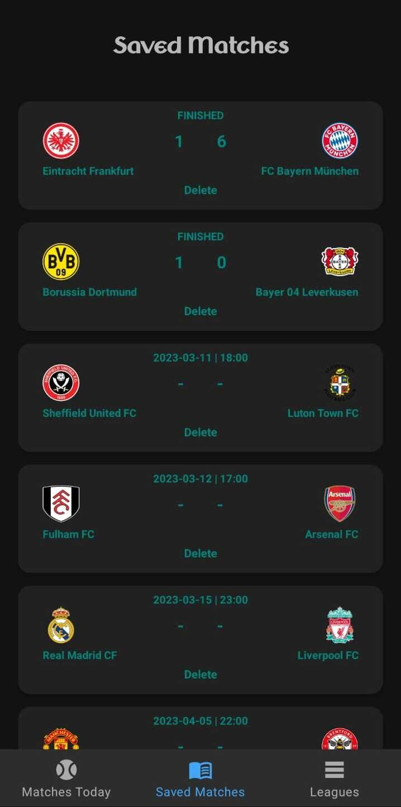
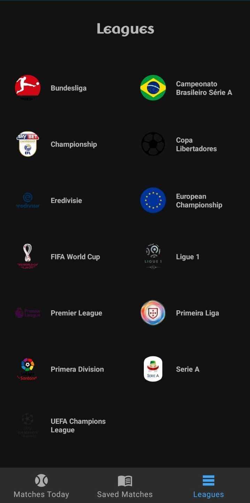
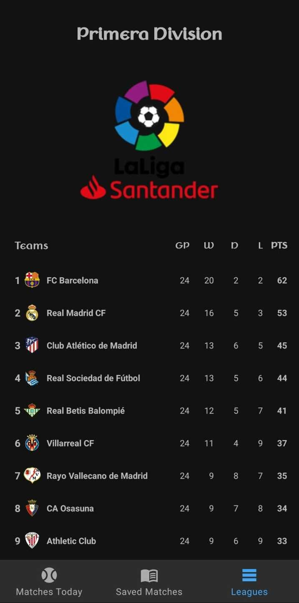
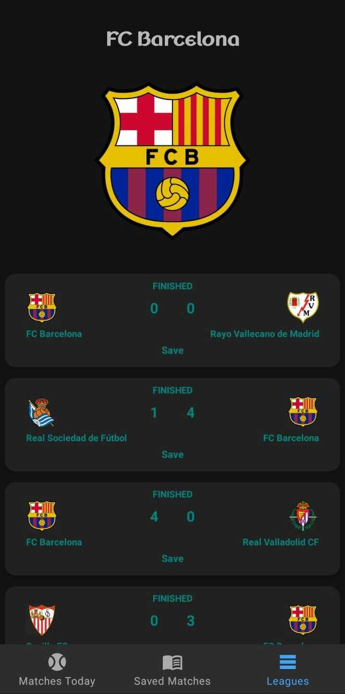
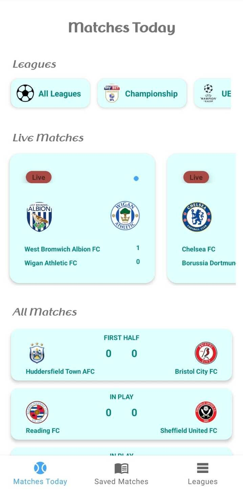
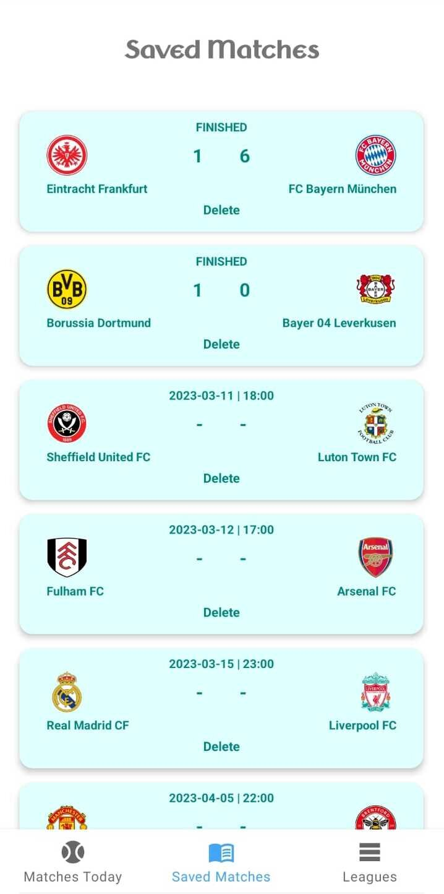
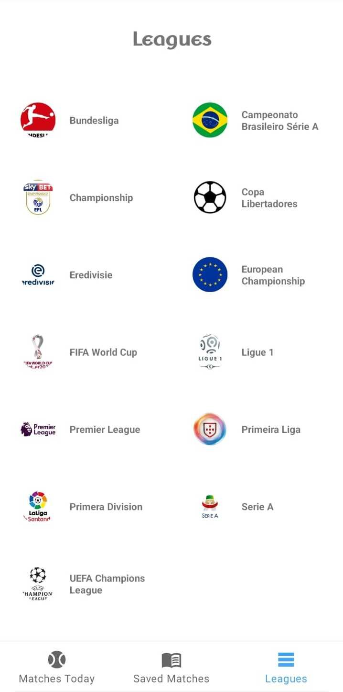
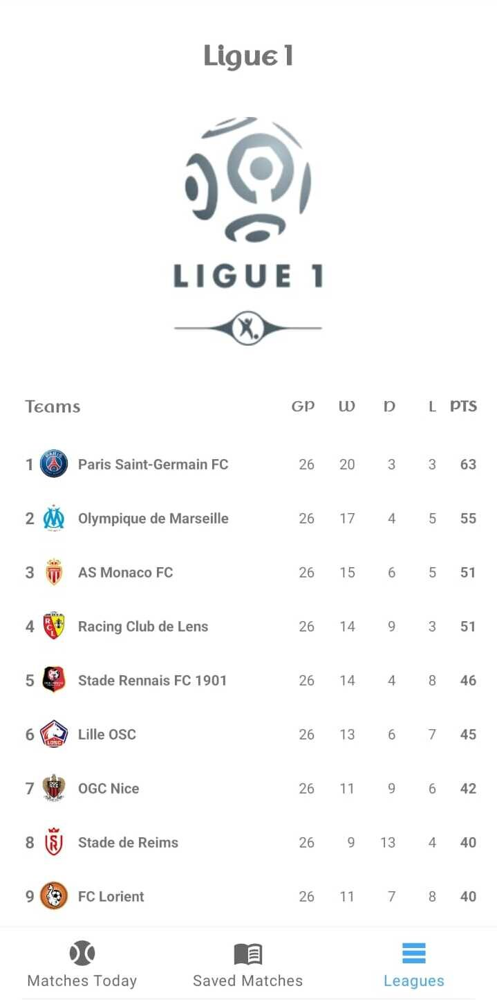
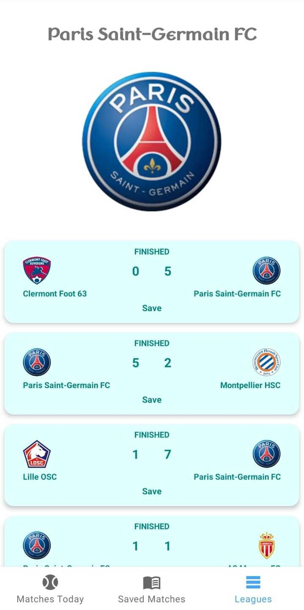

# FootballApp

It's a demo project to schedule today's matches and display up to date league tables. Live matches and scores displays in real time. Users can add matches to favorites to track them easily.<br /><br />
Project is written in Kotlin.💯

<br />

| Mode  | Matches Today | Saved Matches | Leagues | League Table | Team Details |
|------|------|------|------|------|------|
| Dark |  |  |  |  |  |
| Light |  |  |  |  |  |

<br />

### The Aim Of The Project
Implementing new technologies and best practices in android development such as:
 - [Clean Architecture](https://medium.com/android-dev-hacks/detailed-guide-on-android-clean-architecture-9eab262a9011) - Clean architecture is a software design philosophy that separates the elements of a design into ring levels.
 - [SOLID](https://medium.com/the-android-caf%C3%A9/solid-principles-the-kotlin-way-ff717c0d60da) - SOLID is a mnemonic acronym for five design principles intended to make software designs more understandable, flexible, and maintainable.
 - [MVVM](https://developer.android.com/topic/libraries/architecture/viewmodel) - Its principal advantage is that it caches state and persists it through configuration changes.
 - [HILT](https://dagger.dev/hilt) - Hilt provides a standard way to incorporate Dagger dependency injection into an Android application.
 - [Navigation Components](https://developer.android.com/guide/navigation/navigation-getting-started) - Navigation component helps you implement navigation, from simple button clicks to more complex patterns, such as app bars and the navigation drawer.
 - [Architecture Components](https://developer.android.com/topic/libraries/architecture) - It's a new collection of libraries that contains the lifecycle-aware components. It can solve problems with configuration changes, supports data persistence, reduces boilerplate code, helps to prevent memory leaks and simplifies async data loading into your UI.
 - [Coroutines](https://kotlinlang.org/docs/reference/coroutines-overview.html) - In addition to opening the doors to asynchronous programming, coroutines also provide a wealth of other possibilities, such as concurrency and actors.
 - [Retrofit](https://square.github.io/retrofit/) - A type-safe HTTP client for Android and Java. Retrofit turns your HTTP API into a Java interface.
 - [Room](https://developer.android.com/training/data-storage/room) - The Room persistence library provides an abstraction layer over SQLite to allow fluent database access while harnessing the full power of SQLite.
 - [LiveData](https://developer.android.com/topic/libraries/architecture/livedata) - LiveData is an observable data holder class. Unlike a regular observable, LiveData is lifecycle-aware, meaning it respects the lifecycle of other app components, such as activities, fragments, or services.
 - [ViewBinding](https://developer.android.com/topic/libraries/view-binding) - View binding is a feature that allows you to more easily write code that interacts with views. Once view binding is enabled in a module, it generates a binding class for each XML layout file present in that module.
 - [Coil](https://coil-kt.github.io/coil/) - An image loading library for Android backed by Kotlin Coroutines.

<br />

### License
```
   Copyright (C) 2023 Mert Yazı
   Licensed under the Apache License, Version 2.0 (the "License");
   you may not use this file except in compliance with the License.
   You may obtain a copy of the License at

       http://www.apache.org/licenses/LICENSE-2.0

   Unless required by applicable law or agreed to in writing, software
   distributed under the License is distributed on an "AS IS" BASIS,
   WITHOUT WARRANTIES OR CONDITIONS OF ANY KIND, either express or implied.
   See the License for the specific language governing permissions and
   limitations under the License.
```
<br />

### API Note
This project is capable of to use free plan of the API key with it's limitations. If you want to add more new features to the app or increase refreshing interval of the data, you might need to get paid plan of the API key.

<br />

### Contributing
- Just make a pull request.
- Get an API key for your own from "https://www.football-data.org/"
- Paste that key to "gradle.properties" with keyword "API_KEY".
